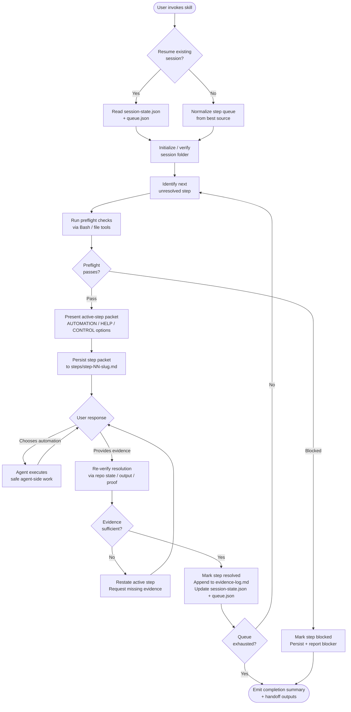

# step-by-step
Turns a task list, rollout checklist, or validation matrix into a single-active-step workflow that alternates agent work with human-in-the-loop confirmation. Each step is preflight-verified, presented as a structured packet with chooseable automation and help options, and gated on evidence before advancing. Session state is persisted to a timestamped folder so context survives handoffs and conversation resets.

## Install

The fastest cross-agent install path is the `skills` CLI:

```bash
npx skills add gg-skills/step-by-step
```

Drop this skill into a workspace as a Git submodule for pinned versions, or as a plain clone for latest `main`:

```bash
# Project-local, version-pinned:
git submodule add git@github.com:gg-skills/step-by-step.git .claude/skills/step-by-step

# OR project-local, latest main:
mkdir -p .claude/skills
git -C .claude/skills clone git@github.com:gg-skills/step-by-step.git

# OR user-level, available in every project on this machine:
mkdir -p ~/.claude/skills
git -C ~/.claude/skills clone git@github.com:gg-skills/step-by-step.git
```

Restart your agent or reload skills after installation. See the parent [`skills` catalog repo](https://github.com/gg-skills/skills) for the full catalog.

## When to use

- A task mixes agent-executable work with user-run manual actions or validations.
- Execution needs human-in-the-loop confirmation between steps.
- A plan, study, or task contains a sequential rollout, setup, or verification checklist.
- The user explicitly asks for step-by-step guidance or asks "what do I do next?".

**Skip when:** the entire task can be run autonomously without user involvement, the user wants the full checklist dumped at once, or no ordered step queue can be identified.

## How it operates

### Inputs

| Input | Description |
|-------|-------------|
| User checklist (conversation) | Free-text or bullet list provided by the user in the chat. |
| `.plans/` artifact | Active plan file with a sequential execution or verification section. |
| Study rollout list | Validation or reproduction checklist handed off from `study`. |
| External task tracker checklist | Manual follow-up section from a task tracker (e.g. Linear). |
| `.tmp/step-by-step/<session>/session-state.json` | Resume input: canonical state from a previous run. |
| `.tmp/step-by-step/<session>/queue.json` | Resume input: normalized step queue from a previous run. |

No environment variables are required. The skill reads the working repository using standard Bash/file tools to run preflight checks.

### Outputs

| Output path | Format | Description |
|-------------|--------|-------------|
| `.tmp/step-by-step/YYYY-MM-DD-HHmmss-<slug>/session-summary.md` | Markdown | Human-readable session overview: title, source, overall status, active step, final summary. |
| `.tmp/step-by-step/YYYY-MM-DD-HHmmss-<slug>/session-state.json` | JSON | Canonical machine-readable state: `sessionId`, `currentStepId`, `status`, `steps[]`, timestamps. |
| `.tmp/step-by-step/YYYY-MM-DD-HHmmss-<slug>/queue.md` | Markdown | Ordered queue with prerequisites, statuses, and completion notes. |
| `.tmp/step-by-step/YYYY-MM-DD-HHmmss-<slug>/queue.json` | JSON | Machine-readable queue for deterministic resume and cross-skill handoff. |
| `.tmp/step-by-step/YYYY-MM-DD-HHmmss-<slug>/evidence-log.md` | Markdown | Append-only journal of preflight checks, commands, outputs, confirmations, and blockers. |
| `.tmp/step-by-step/YYYY-MM-DD-HHmmss-<slug>/steps/step-NN-<slug>.md` | Markdown | One file per step: packet shown to user, preflight results, options, evidence, and resolution outcome. |

Optional subfolders: `artifacts/`, `screenshots/`, `attachments/`.

### External commands

The skill uses standard Bash and file tools for preflight checks — reading repo state, running verification commands, checking file existence, and capturing command output. It does not call any external APIs or network services directly. Cross-skill handoffs may invoke `plan`, `study`, `decisions`, or `research-online` when the current step requires it.

### Side effects

- Creates and writes the `.tmp/step-by-step/` session folder tree on the first step presentation.
- Appends to `evidence-log.md` after every status change.
- Writes or updates `session-state.json` and `queue.json` after queue normalization, each active-step packet, each evidence change, and before any handoff.
- Optionally updates the upstream plan, study, or task-tracker artifact to reflect resolved steps when one is identified.
- The `.tmp/` folder should be gitignored; the skill does not commit session artifacts.

### Mode toggles

| Mode | Behavior |
|------|----------|
| Fresh session | Normalizes the step queue from the best available source, initializes a new timestamped folder, and presents step 1. |
| Resume session | Reads `session-state.json` and `queue.json`, reconciles disagreements, and continues from `currentStepId`. |
| Substep split | When a step is too large, the user can request a split; the skill updates the normalized queue with the new substeps and renumbers rather than presenting them ad-hoc. |
| Blocked step | Marks the step `blocked`, explains impact on downstream steps, and preserves the queue. |
| Cross-skill handoff | Emits session path, `currentStepId`, `queue.json`, and evidence summary to the receiving skill. |

## Operational flow



## Layout

```
step-by-step/
├── SKILL.md                        # Skill descriptor and full policy
├── README.md                       # This file
├── references/
│   ├── session-artifact-contract.md   # Session folder layout, persistence timing, resume rules
│   └── step-presentation-contract.md  # Active-step packet structure and option groups
├── agents/
│   └── openai.yaml                 # OpenAI-compatible agent descriptor
└── assets/
    ├── icon-small.svg
    ├── icon-large.svg
    ├── icon-large.png
    └── icon-master.png
```

## Quick start

1. Install the submodule (see Install above).
2. Start a conversation: paste a checklist or describe a rollout task.
3. The skill normalizes the queue, creates `.tmp/step-by-step/<timestamp>-<slug>/`, and presents **Step 1** as a structured packet.
4. Choose a token from `AUTOMATION_OPTIONS`, `HELP_OPTIONS`, or `CONTROL_OPTIONS`, or reply naturally.
5. Provide the requested evidence; the skill re-verifies and advances to Step 2.
6. To resume a dropped session: open the repo in the same project and mention the session slug — the skill reads `session-state.json` and continues from the last active step.

## Resources

- [SKILL.md](SKILL.md) — full trigger guide, non-negotiable policy, cross-skill coordination, and handoff output spec.
- [references/session-artifact-contract.md](references/session-artifact-contract.md) — session folder layout, required files, persistence timing, and resume rules.
- [references/step-presentation-contract.md](references/step-presentation-contract.md) — active-step packet structure, chooseable option groups, and resolution-check rules.
- [gg-skills](https://github.com/gg-skills/skills) — parent skill library.

## Caveats

- The `.tmp/` session folder must be gitignored; the skill does not manage `.gitignore` automatically.
- Session state is local to the working directory. Moving the repo or switching worktrees requires copying the `.tmp/step-by-step/` tree manually.
- Substep splits renumber the queue; if an upstream plan or task tracker is synced, the agent reports the renumbering but does not automatically update external IDs.
- Cross-skill handoffs to `plan`, `study`, or `decisions` include the session path and queue snapshot, but those skills must be installed separately.
